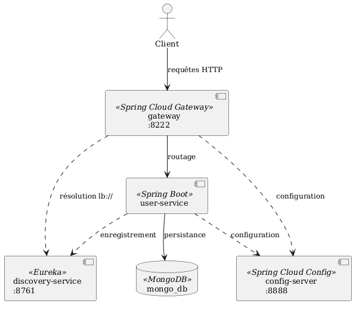
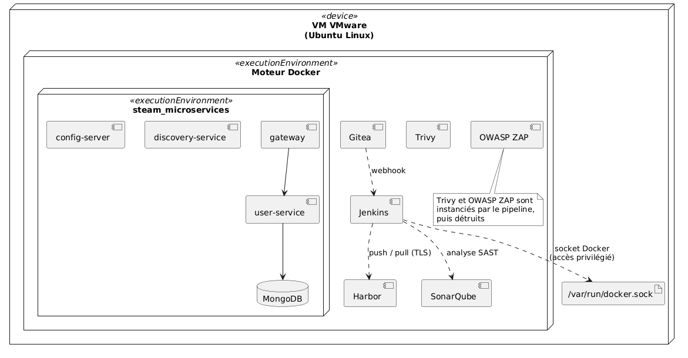
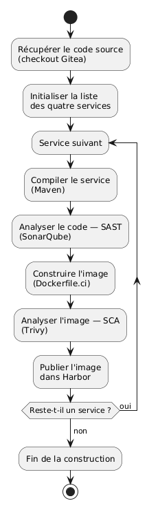
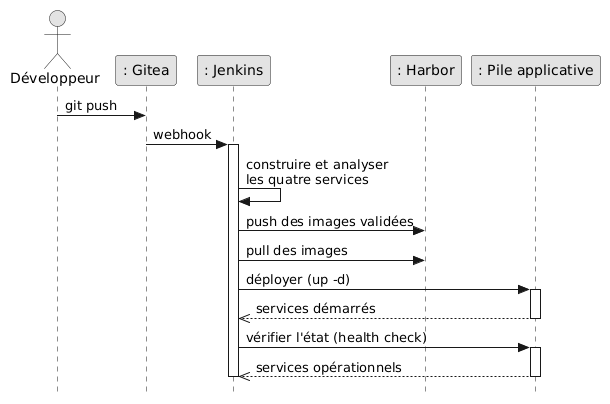

# Chaîne CI/CD DevSecOps — Microservices Spring Boot


Chaîne **CI/CD sécurisée (DevSecOps)** pour une architecture de microservices *Spring Boot*,
réalisée lors d'un stage chez **Proxym Group**. D'un *push* au déploiement vérifié, sans
intervention manuelle, avec la sécurité intégrée à chaque étape.

> La sécurité n'est pas ajoutée en fin de parcours, mais **tissée progressivement** :
> d'abord *informative* (observation), puis *contraignante* (barrières bloquantes).

---

## Stack

Gitea · Jenkins · Maven · Docker · Docker Compose · Harbor · SonarQube · Trivy · OWASP ZAP

## Architecture

**4 services** d'une plateforme *Spring Cloud* et leur base de données :
`config-server` (8888) · `discovery-service` / Eureka (8761) · `gateway` / JWT (8222) ·
`user-service` (8090) + **MongoDB**.

<p align="center">
  
</p>

Le tout hébergé sur une VM unique, sur un réseau Docker commun :

<p align="center">
  
</p>

## Pipeline

Déclenchement automatique par **webhook Gitea → Jenkins**. Pour chaque service :
compilation → SAST → build image → SCA → publication ; puis déploiement, *health check*
et analyse dynamique.

<p align="center">
  
  &nbsp;&nbsp;&nbsp;
  
</p>

## Sécurité intégrée

| Analyse | Outil | Posture |
|---|---|---|
| SAST | SonarQube | Bloquante — échec si le *quality gate* n'est pas franchi |
| SCA | Trivy | Bloquante — échec sur vulnérabilité **CRITICAL corrigeable**, avant publication |
| DAST | OWASP ZAP | Observation — alertes non déterministes (application de démonstration) |

<p align="center">
  
</p>

## Démarrage

Pré-requis : une VM Linux avec Docker ; l'outillage (Gitea, Jenkins, Harbor, SonarQube)
démarré sur un réseau Docker commun ; Jenkins configuré (socket Docker, *credentials* Gitea
et Harbor, serveur `sonar` + webhook `http://jenkins:8080/sonarqube-webhook/`).

Le pipeline se lance à chaque *push*, ou manuellement via *Build with Parameters*
(`IMAGE_TAG`, `RUN_TESTS`, `DEPLOY`).

## Structure

```
.
├── Jenkinsfile                 # pipeline as code
├── docker-compose.deploy.yml   # déploiement de la pile
├── config-server/ · discovery-service/ · gateway/ · user-service/
└── docs/                       # diagrammes
```

---

**Autrice :** Farah Grissa — ENSI · Stage chez Proxym Group
*(application microservices préexistante ; contribution = la chaîne CI/CD sécurisée)*
